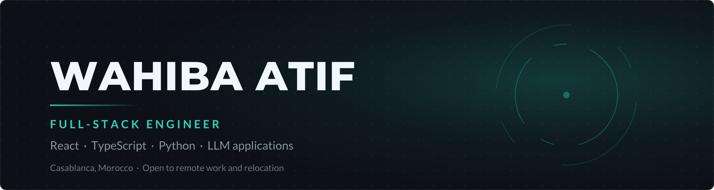

 

Full-stack engineer at **KLK Khayatey Living**, Casablanca.
I build web applications end to end — data model, API, interface —
in TypeScript and Python, with hands-on LLM work.

<a href="https://linkedin.com/in/wahiba-atif">LinkedIn</a> &nbsp;·&nbsp;
<a href="mailto:atifwahiba1@gmail.com">atifwahiba1@gmail.com</a>

 

## Currently

Building an internal ERP at KLK Khayatey Living: Prisma schema over
PostgreSQL, a REST API in Node.js / Express, and a React 19 interface
with Vite and TailwindCSS. I own the feature area end to end, write the
tests, and take part in code review.

 

## Stack

**Languages**

**Frontend**

**Backend**

**Data & AI**

**Infrastructure**

 

## Selected projects

**[JenkLog](LINK)** — ML monitoring for CI/CD pipelines
Microservices platform that structures Jenkins logs, detects build
failures with ML models and proposes fixes, with a dashboard and
real-time alerting.
`Python` `FastAPI` `Spring Boot` `React` `Kafka` `PostgreSQL` `Docker`

**[SmartDoc AI](LINK)** — Document classification with a voice assistant
An on-device CNN classifies scanned documents; an LLM-driven voice
assistant handles the speech-to-text and text-to-speech loop.
`Python` `TensorFlow Lite` `GPT / Gemini` `Flutter` `Firebase`

**[SangConnect](LINK)** — Blood donation platform
Connects donors, requesters and administrators, with monitoring
dashboards across the stack.
`Java` `Spring Boot` `React` `Oracle` `Grafana` `Kibana`

**[Delivery Tracker](LINK)** — Event-driven order tracking
Order lifecycle over a message bus: CRUD, REST APIs and SQL stores.
`Java` `Spring Boot` `React` `Kafka` `MySQL`

 

## Background

**Engineering degree, Computer Science and Networks** — EMSI Casablanca, 2023–2026
**Advanced Technician Diploma, Full-Stack Web Development** — ISGI Casablanca, 2021–2023
